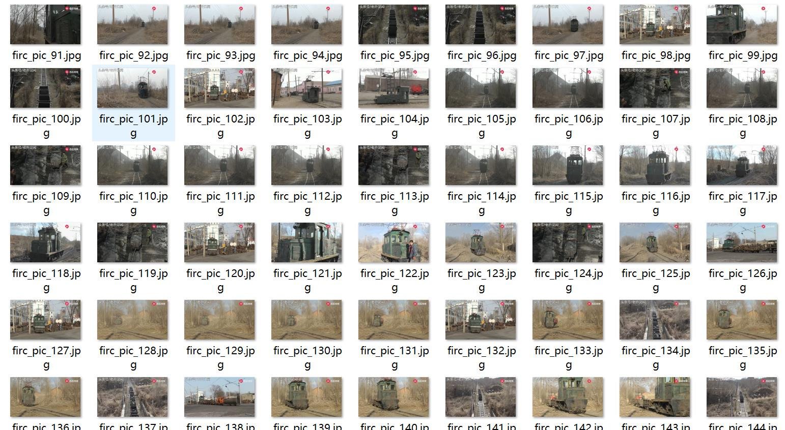
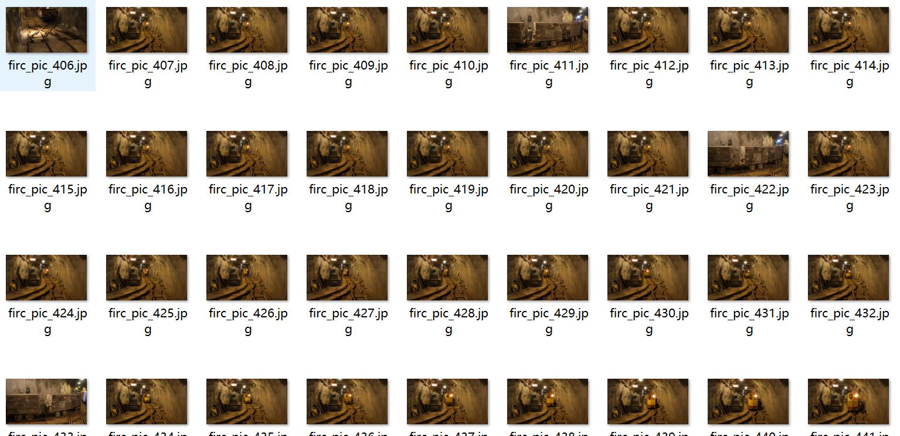
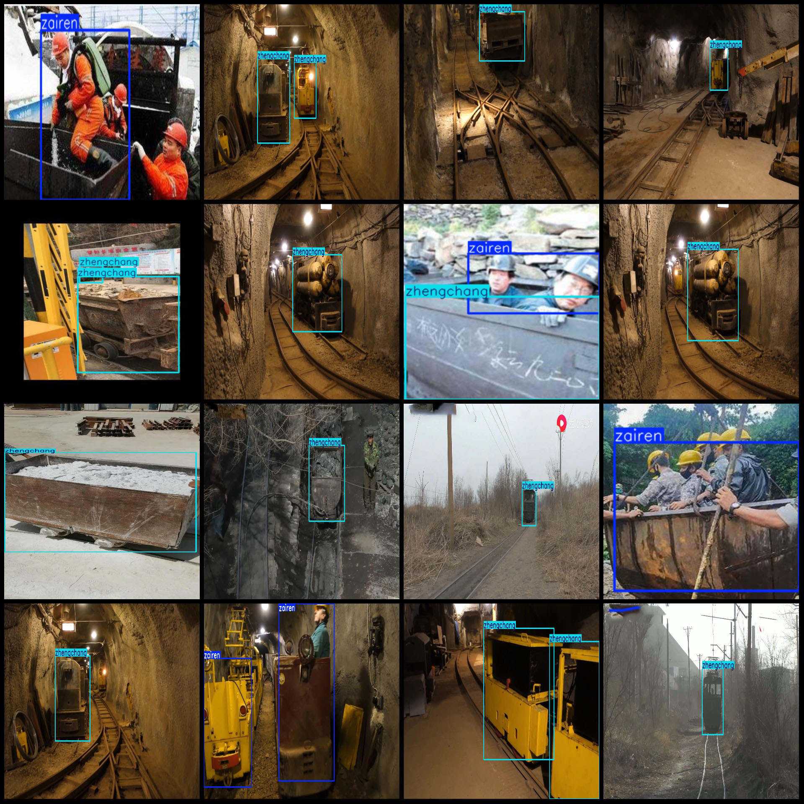
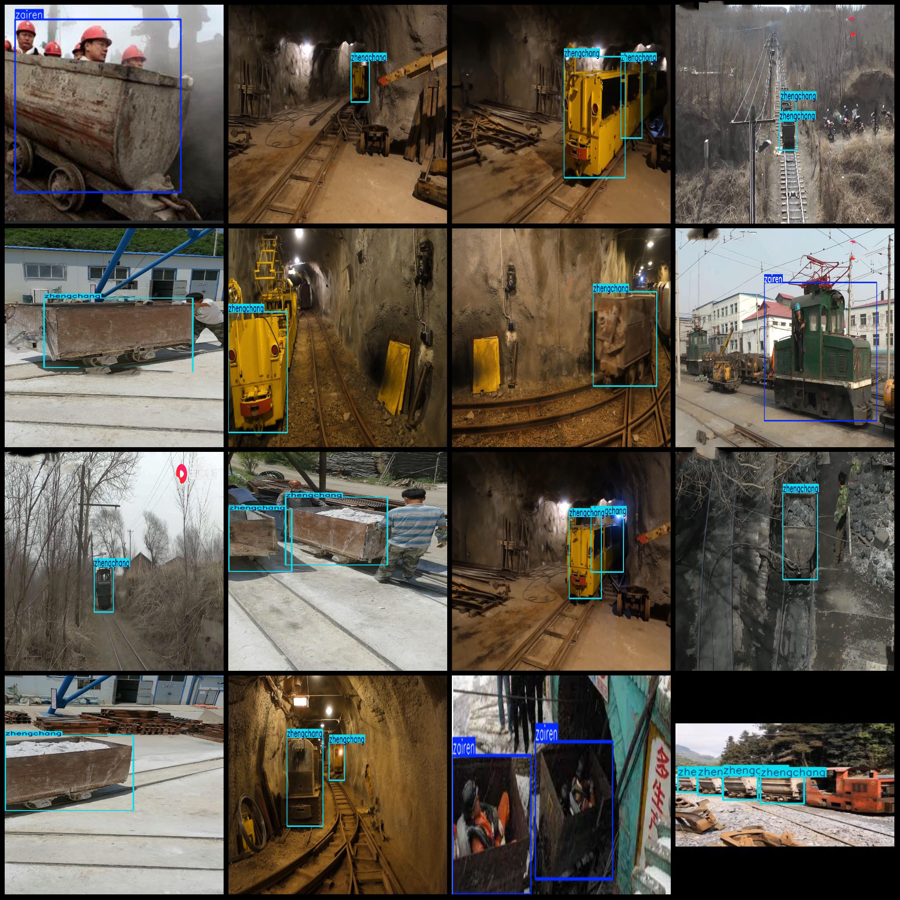

# Intelligent Mine Car with People Violation Detection Data Set (VOC+YOLO format) - 950 Images in 2 Categories

Dataset Format: Pascal VOC format + YOLO format (txt files without split paths, only containing jpg images along with corresponding VOC format xml files and YOLO format txt files).
Number of Images (jpg file count): 950
Number of Annotations (xml file count): 950
Number of Annotations (txt file count): 950
Number of Annotation Categories: 2
Annotation Category Names (Note: the order of categories in the YOLO format does not correspond to this, but is based on the labels folder's classes.txt): ["zairen", "zhengchang"]
Each Category of Boxes Count:
- zairen (People) = 361 boxes
- zhengchang (Normal) = 1507 boxes
Total Boxes Count: 1868
Each Category Occupies Number of Images:
- zairen (People) = 309 images
- zhengchang (Normal) = 757 images
Image Resolution: 1920x1080
Annotation Tool Used: labelImg
Annotation Rules: Draw a box around the category
Important Note: The dataset does not have been split into training/validation/test sets; you need to do it yourself.
Special Notice: This dataset does not guarantee the accuracy of the trained models or weight files.
Image Preview:
Annotation Example:

## Images

Here is a pay link on Stripe ( https://buy.stripe.com/3cs8yP7sY87d0vu9AB ). Please contact me lonlonago@foxmail.com after funding $89, and I will send you a complete data files , thank you!

